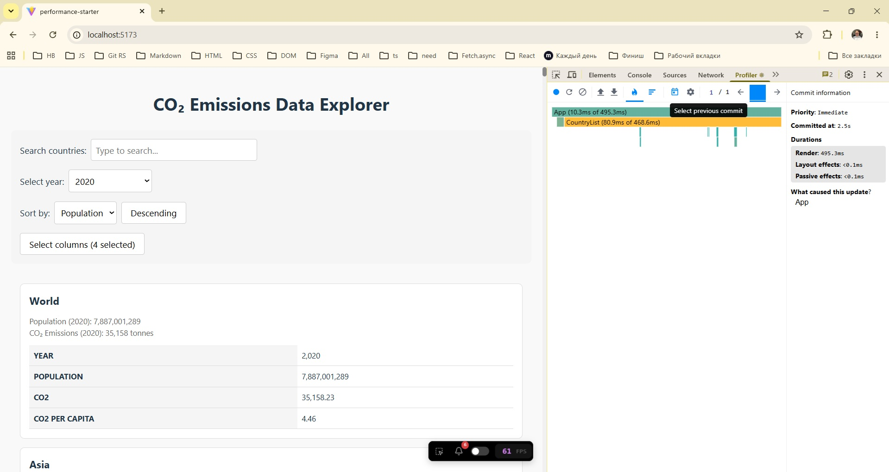
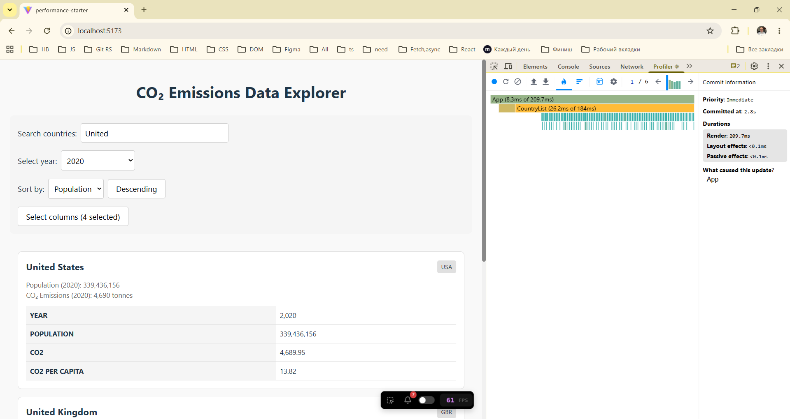
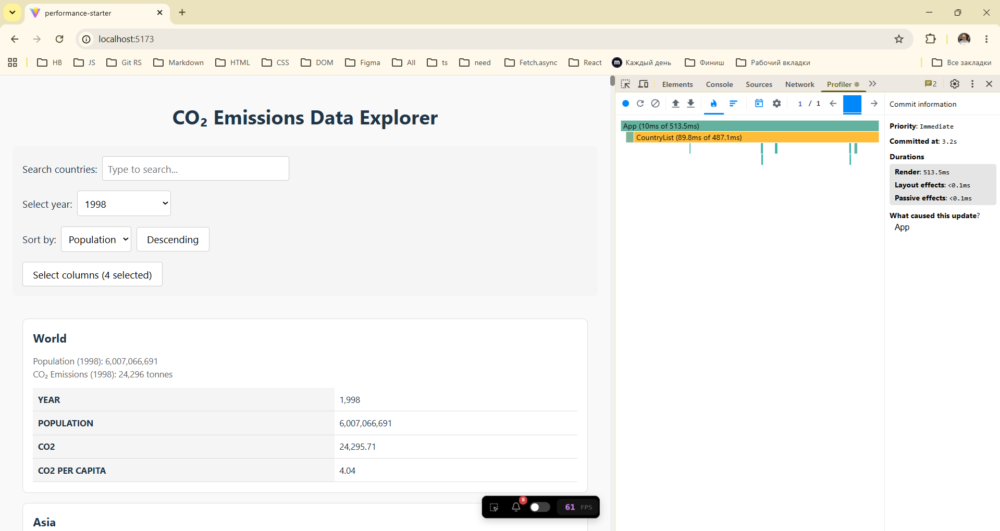
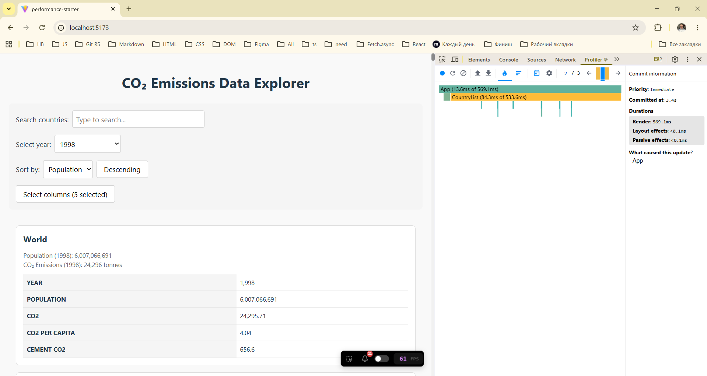
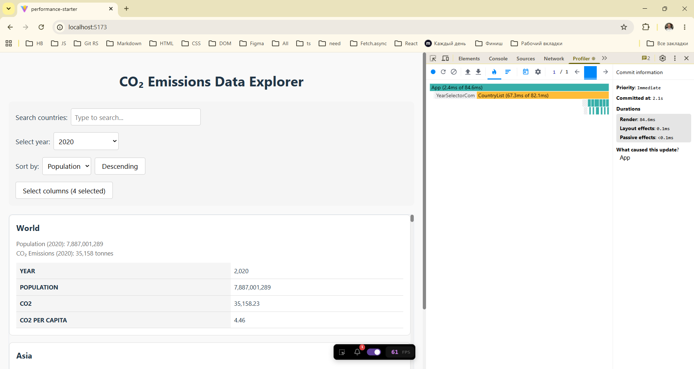
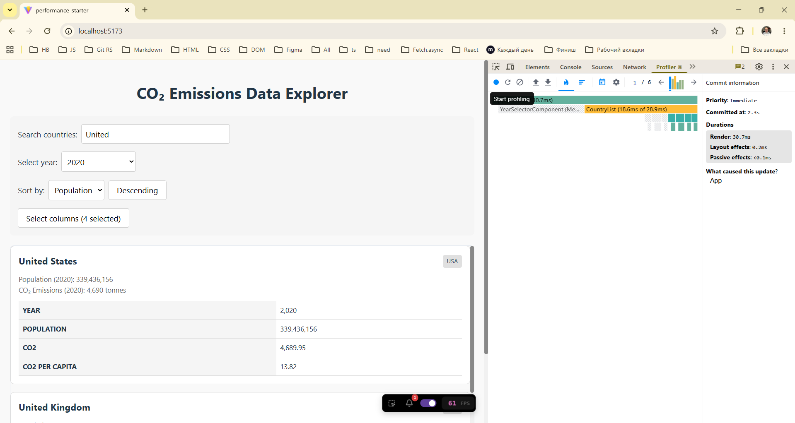
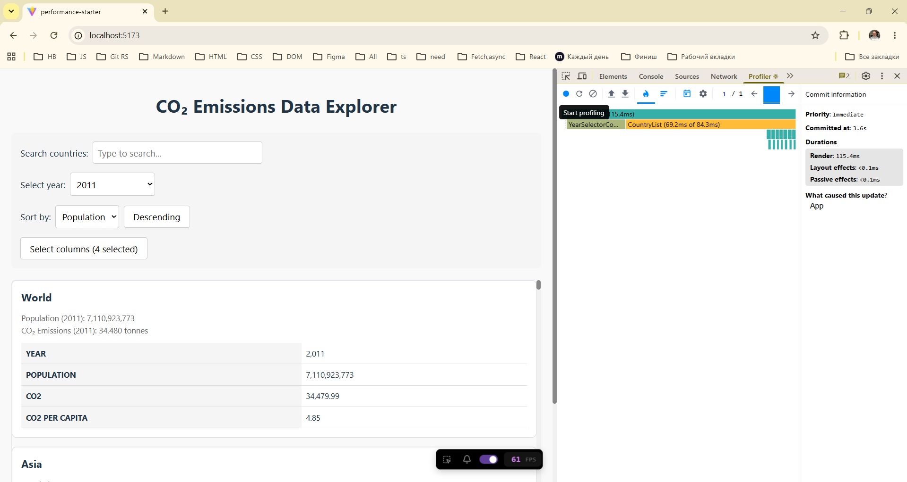
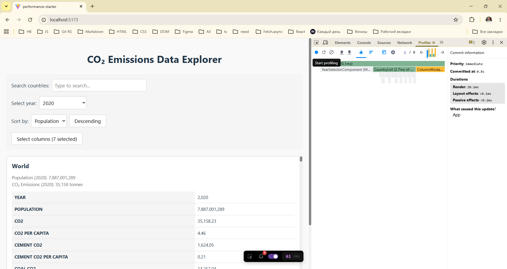

# Performance Optimization Report

## Baseline Measurements

### Interaction A: Sort countries

- **Commit duration**: \2\.\5 s
- **Render duration**: \4\9\5\.\3 ms
- **Screenshot**: 

### Interaction B: Search countries

- **Commit duration**: \2\.\8 s
- **Render duration**: \2\0\9\.\7 ms
- **Screenshot**: 

### Interaction C: Change year

- **Commit duration**: \3\.\2 s
- **Render duration**: \5\1\3\.\5 ms
- **Screenshot**: 

### Interaction D: Toggle column

- **Commit duration**: \3\.\4 s
- **Render duration**: \5\6\9\.\1 ms
- **Screenshot**: 

## Optimized Measurements

### Interaction A: Sort countries

- **Commit duration**: \2\.\1 s
- **Render duration**: \8\4\.\6 ms
- **Screenshot**: 

### Interaction B: Search countries

- **Commit duration**: \2\.\3 s
- **Render duration**: \3\0\.\7 ms
- **Screenshot**: 

### Interaction C: Change year

- **Commit duration**: \3\.\6 s
- **Render duration**: \1\1\5\.\4 ms
- **Screenshot**: 

### Interaction D: Toggle column

- **Commit duration**: \0\.\8 s
- **Render duration**: \2\0\.\1 ms
- **Screenshot**: 

## Summary of Improvements

| Interaction      | Baseline (ms) | Optimized (ms) |  Improvement  |
| ---------------- | ------------- | -------------- |  -----------  |
| Sort countries   | \4\9\5\.\3    | \8\4\.\6       |  \8\2\.\9%    |
| Search countries | \2\0\9\.\7    | \3\0\.\7       |  \8\5\.\4%    |
| Change year      | \5\1\3\.\5    | \1\1\5\.\4     |  \7\7\.\5%    |
| Toggle column    | \5\6\9\.\1    | \2\0\.\1       |  \9\6\.\5%    |
| **Average**      | **\4\4\6\.\9**| **\6\2\.\7**   | **\8\6\.\0%** |